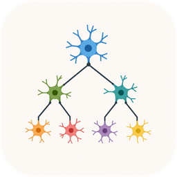

<p align="center">
  
</p>

<h1 align="center">Agentree</h1>

<p align="center">
  See your coding-agent conversations as trees. Fork them anywhere.
</p>

---

**Agentree** is a desktop app that reads the session files your coding agents
already keep on disk and draws each conversation as an interactive tree —
every prompt, reply, and branch, across all your projects, in one place.

Select any turn and Agentree hands you a ready-to-paste command that resumes
the conversation **from that exact point**, as a new branch. Explore an idea,
rewind, try another path — without losing anything.

Supported harnesses:

| Agent | Session store | Resume / fork |
|-------|---------------|----------------|
| **Claude Code** | `~/.claude/projects` | branches natively inside one session |
| **OpenAI Codex CLI** | `~/.codex/sessions` | fork becomes a new session, drawn as one tree |
| **GitHub Copilot CLI** | `~/.copilot/session-state` | fork becomes a new session, drawn as one tree |

## Features

- **One list, three harnesses** — every conversation on your machine, newest
  first, filterable by project directory, with live updates as agents run.
- **Tree view** — branches are first-class: long linear runs collapse into
  compact chains, branch points stay visible, and the current tip is
  highlighted.
- **Fork after any turn** — one click produces the exact CLI command that
  continues the conversation from that turn as a new branch. Nothing is
  modified or deleted; forks are strictly additive.
- **Read the conversation** — full Markdown rendering of any turn, its
  thinking and tool calls, plus a "view conversation up to here" reader for
  the whole prefix.
- **Annotate** — star turns, label branches, and mark dead ends (dimming the
  whole abandoned subtree). Annotations live in a sidecar, never in your
  transcripts.
- **Token overlays** — per-turn context size, prompt cost, and cache-hit
  rates, straight from the transcripts.

## Privacy

Agentree runs entirely on your machine. No API keys, no accounts, no network
calls, no telemetry. Your transcripts are never modified: annotations go to
`~/.agentree/`, and forking (for harnesses that need it) only ever *creates*
a new session file.

## Installation

Requirements: [Node.js](https://nodejs.org) 20 or later.

```sh
git clone https://github.com/scercelescu-QNT/agentree.git
cd agentree
npm install
npm run build
npm start
```

That's it — Agentree finds your sessions automatically. If a harness isn't
installed, it's simply skipped.

For development (hot reload):

```sh
npm run dev
```

## Usage

1. Launch the app. The welcome screen lists every conversation, newest first.
   Use the directory rail or the search box to narrow it down.
2. Click a conversation to open its tree. Drag to pan, scroll to zoom,
   **fit** to re-frame. Click a chain pill to expand collapsed turns.
3. Select a turn to read it in the side panel, then use
   **⑂ fork after this turn** to get a resume command. Paste it into your
   terminal — the new exchange appears in the tree as a branch, live.

## How it works

Each harness stores transcripts differently — Claude Code writes a native
DAG, Codex and Copilot write linear logs where a fork is a new file sharing a
copied prefix. Agentree projects all of them onto one tree model and stitches
fork families back together so a branched conversation always reads as a
single tree. The full write-up, including the transcript formats and fork
mechanics, is in [AGENTS.md](AGENTS.md).

## Contributing

Issues and pull requests are welcome. If a harness update changes a
transcript format, an issue with a (redacted) sample of the new records is
the fastest path to a fix.

## License

[MIT](LICENSE)
