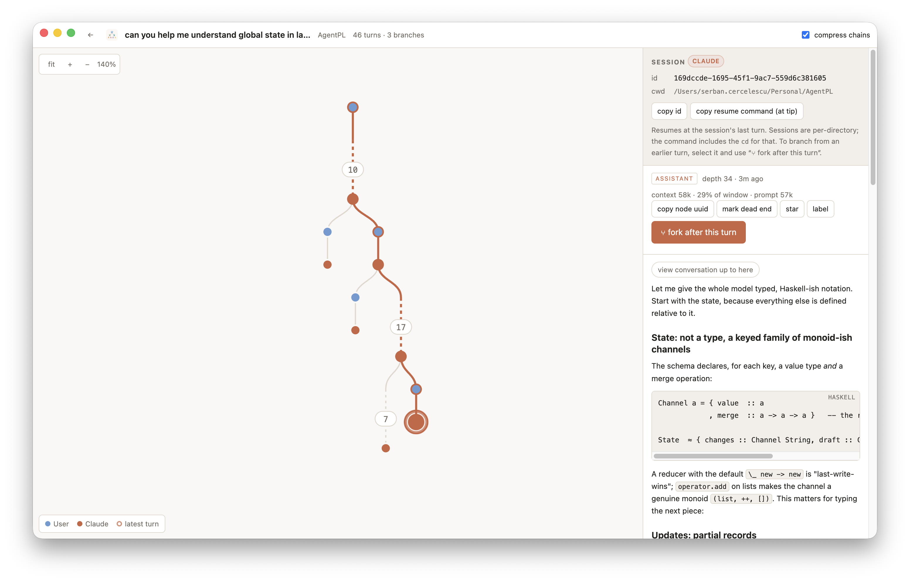

<p align="center">
  
</p>

<h1 align="center">Agentree</h1>

<p align="center">
  See your coding-agent conversations as trees. Fork them anywhere.
</p>

---

<p align="center">
  
</p>

**Agentree** is a desktop app that reads the session files your coding agents
already keep on disk and draws each conversation as an interactive tree —
every prompt, reply, and branch, across all your projects, in one place.

Select any turn and Agentree hands you a ready-to-paste command that resumes
the conversation **from that exact point**, as a new branch. Explore an idea,
rewind, try another path — without losing anything.

Supported harnesses:

| Agent | Session store | Resume / fork |
|-------|---------------|----------------|
| **Claude Code** | `~/.claude/projects` | branches natively inside one session |
| **OpenAI Codex CLI** | `~/.codex/sessions` | fork becomes a new session, drawn as one tree |
| **GitHub Copilot CLI** | `~/.copilot/session-state` | fork becomes a new session, drawn as one tree |

## Features

- **One list, three harnesses** — every conversation on your machine, newest
  first, filterable by project directory, with live updates as agents run.
- **Tree view** — branches are first-class: long linear runs collapse into
  compact chains, branch points stay visible, and the current tip is
  highlighted.
- **Fork after any turn** — one click produces the exact CLI command that
  continues the conversation from that turn as a new branch. Nothing is
  modified or deleted; forks are strictly additive.
- **Read the conversation** — full Markdown rendering of any turn, its
  thinking and tool calls, plus a "view conversation up to here" reader for
  the whole prefix.
- **Annotate** — star turns, label branches, and mark dead ends (dimming the
  whole abandoned subtree). Annotations live in a sidecar, never in your
  transcripts.
- **Token overlays** — per-turn context size, prompt cost, and cache-hit
  rates, straight from the transcripts.

## Privacy

Agentree runs entirely on your machine. No API keys, no accounts, no
telemetry. Your transcripts are never modified: annotations go to
`~/.agentree/`, and forking (for harnesses that need it) only ever *creates*
a new session file.

The only network request is a version check against GitHub at launch (does
`main` have newer commits than this build?). Nothing about you or your
sessions is sent, and it fails silently offline. Set
`AGENTREE_NO_UPDATE_CHECK=1` to disable it entirely.

## Installation

Requirements: [Node.js](https://nodejs.org) 20 or later, git.

```sh
curl -fsSL https://raw.githubusercontent.com/serban-cercelescu/Agentree/main/scripts/install.sh | sh
```

That's the whole install — it clones the source, builds it, and puts
`agentree` on your PATH. Then:

```sh
agentree
```

The app opens and finds your sessions automatically; harnesses that aren't
installed are simply skipped. `agentree --foreground` keeps it attached to
the terminal with logs. Re-run the installer any time to update — the app
also checks GitHub on launch and shows a notice when a newer build exists.

### From a clone

```sh
git clone https://github.com/serban-cercelescu/Agentree.git
cd Agentree
npm install        # installs dependencies and builds the app
npm link           # optional: put `agentree` on your PATH
agentree
```

`npm run dev` starts the hot-reload development setup.
